# Investor Copilot

A conversational assistant for private-markets investors. Ask about holdings, valuations, performance (MOIC, DPI, RVPI), fees, capital calls, distributions, and account statements in plain language, and get answers you can check against the underlying records.

> Built on a synthetic, fictional dataset. Not affiliated with any firm, and not financial advice.

<p align="center">
  
</p>

Private-markets portfolios are difficult to interrogate. Positions span multiple rounds per company, marks move on their own schedule, fees and FX sit in separate tables, and the same investor question can mean several different queries. Investor Copilot gives each investor a single place to ask natural questions and receive answers tied to their own book.

The product is built around one constraint: **the assistant must never invent a number**. It interprets the question, pulls the right records, and explains the result. Every figure is computed from structured portfolio data and returned with the source rows and calculation trace used to produce it.

<p align="center">
  
</p>

## What it does

- **Portfolio Q&A in conversation.** Holdings, company exposure, round-level detail, fees, capital calls, distributions, and statement lines, without navigating spreadsheets or reports.
- **Evidence with every answer.** Each figure links to allocation, valuation, fee, or FX source rows, plus a trace of how it was derived.
- **Tone that fits the investor.** Explanation depth and jargon adapt to profile and tech comfort; the numbers are identical regardless of wording.
- **Multi-currency reporting.** USD, GBP, EUR, and AED are converted to the investor's reporting currency before any total is shown.
- **Messy real-world cases.** Multi-round positions, partial capital calls, exits, write-offs, down rounds, fee discounts, similar-name disambiguation, and partial secondaries are all handled explicitly.

## How it works

Investor Copilot splits **reasoning** from **arithmetic**. A language model reads the question, chooses the right data access path, and writes the reply. All financial math runs in a deterministic compute layer over structured ledger data. That separation keeps answers fast, consistent, and auditable: you can open the cited rows and confirm the math yourself.

Structured portfolio data is queried directly. Document retrieval has a clear role in a full investor platform (memos, letters, contracts); for tabular ledger data, direct computation is the right tool.

Flow: investor → chat UI → `/api/chat` → orchestrator (OpenAI tool calling) → compute layer → in-memory portfolio store (CSVs in this demo).

## Stack

Next.js (App Router) · TypeScript · OpenAI tool calling · Tailwind · Vercel

## Quick start

```bash
npm install
cp .env.example .env.local
npm run dev
```

Set `OPENAI_API_KEY` in `.env.local`. Open http://localhost:3000, pick an investor, and ask a question.

## Verification

```bash
npm run eval
```

Runs golden-number checks (e.g. INV001 MOIC ≈ 2.601×) and structural edge cases against the compute layer. No OpenAI calls.

## Current scope

This is a working prototype, not a production deployment.

- No auth: investor is chosen from a dropdown, simulating a logged-in session.
- No chat persistence: history resets on reload or investor switch.
- Static valuations as of the dataset report date (2026-06-25).
- Single-tenant demo over a synthetic CSV dataset.

## Further reading

- [`ai-workflow.md`](./ai-workflow.md): how the project was built with AI assistance and how correctness was verified.
- [`ROADMAP.md`](./ROADMAP.md): phased plan for a full investor-platform relationship manager.
- [`DATA.md`](./DATA.md): what the synthetic dataset contains.

## License

MIT. See [LICENSE](./LICENSE).
